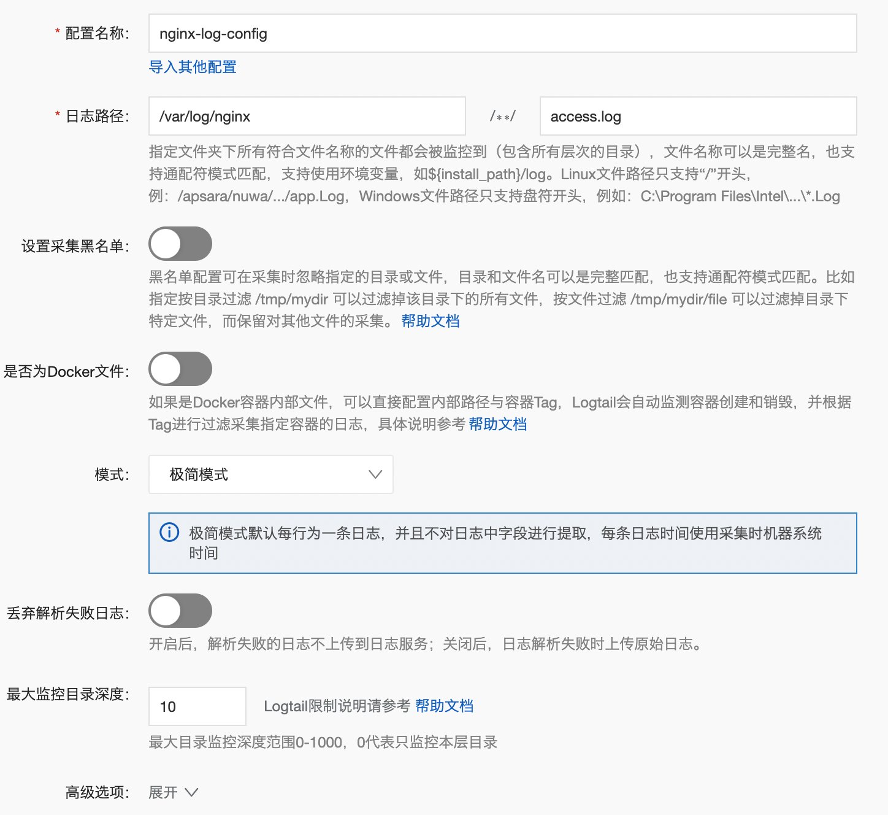
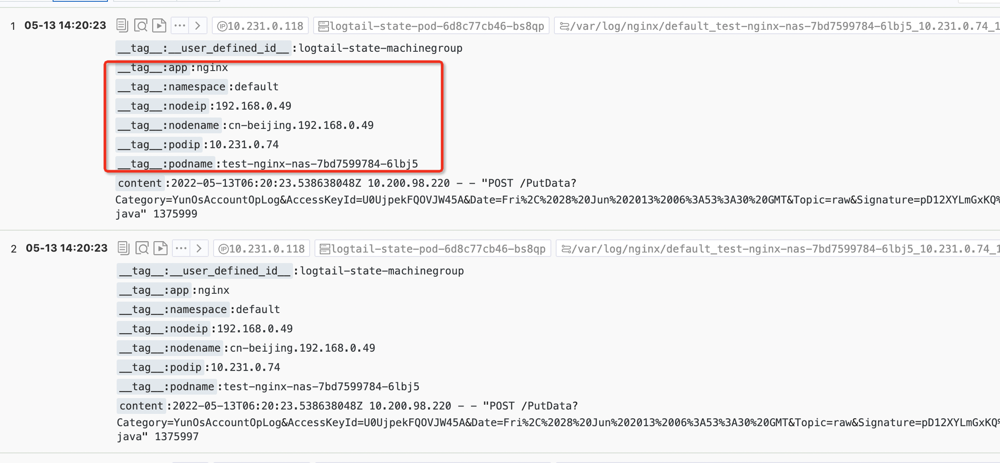
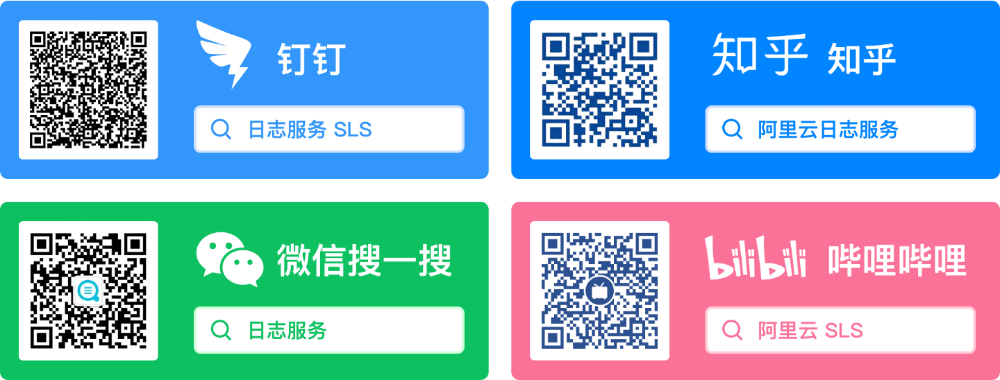

# K8s 挂载 PVC 日志采集“轻量级”玩法

本文介绍一种使用 K8s 挂载 PVC 日志采集时的轻量级部署方式。

## 目标读者

数字化系统开发运维（DevOps）工程师、稳定性工程师（SRE）、可观测平台运维人员等。

## 使用场景

随着 K8s 和云的普及，越来越多的公司将业务系统部署到云上，并且使用 K8s 来部署应用。日志采集是 K8s 应用中非常重要的运维工具，日志服务提供了[Daemonset 和 Sidecar](https://help.aliyun.com/document_detail/66654.html?spm=a2c4g.26937906.0.0.7bc35f68ZZQyyT){target="\_blank"} 两种针对 K8s 的采集方式，对于 K8s 应用的日志采集提供了极大的便捷性。当日志目录挂载 PVC 时，可以使用[Sidecar 方式共享数据卷](https://developer.aliyun.com/article/691428?spm=a2c4g.26937906.0.0.7bc357ea2m4uBN)的方式采集，这种方式需要每个业务容器伴随一个 logtail 容器，具有非常高的采集性能，另一方面也需要更多的资源开销。
本文提供一种相对 Sidecar 部署更轻量级的采集方式，只需要部署少量的 Logtail 容器，即可采集不同业务容器的日志。主要场景如下：

### 场景 1：业务容器用 PVC 挂载日志目录

K8s 的 CSI 插件支持用户可以指定多种存储服务，很多用户也选择用 PVC 的方式挂载日志目录，在这种方式下 Daemonset 的采集方式不适合（Daemonset 默认通过采集容器映射到宿主机的目录来采集日志）；

业务 pod 由于各种原因崩溃的时候，如果业务容器的日志没有保存在持久化的存储上，可能会有日志的丢失，使用 PVC 将业务容器的日志目录挂载在持久化存储比如网盘中，这样可以保证业务容器的日志最大限度的保存。

### 场景 2：Logtail 容器使用 PVC 挂载 checkpoint 目录

对于 Node 宕机的情况，业务容器的日志和 Logtail 的本身的 checkpoint 信息如果都是保存在宿主机的文件系统，可能也会造成一定程度的丢失。这时除了将业务容器的日志使用 PVC 挂载，也可以将 Logtail 的持久化目录进行 PVC 挂载，保证 Checkpoint 的持久化。

## 相关概念

### Logtail

Logtail 是日志服务提供的日志采集 Agent，用于采集阿里云 ECS、自建 IDC、其他云厂商等服务器上的日志。本文介绍 Logtail 的功能、优势、使用限制及配置流程等信息。

### PVC

全称：PersistentVolumeClaim，PersistentVolumes 是用户在不知道特定云环境的细节的情况下，实现持久化存储的一种方式。使得开发人员可以不需要关心背后存储的情况下，直接指定相应的存储需求。PVC 与 PV 的关系类似接口与实现的关系。

## 方案架构

本方案主要通过业务容器和 Logtail 容器共享同样的 PVC 来实现日志采集，同时一定程度上避免了 Sidecar 的开销。


## 方案优势

通过将业务容器的日志目录通过 PVC 的方式挂载到持久化的网盘或者 NAS 中，这样可以最大程度的保证无论是 Pod 崩溃还是 Node（物理机节点或者虚拟机节点）崩溃的情况下，日志得以持久化到网盘或者 NAS 中；同时 Logtail 的持久化配置也可以借助 NAS 来进行持久化保存，以保证采集过程中的日志的连续性。

其中 Logtail 持久化方案可以参考[《K8s 采集专题-稳定性：iLogtail 容器重启数据可靠性探讨》](https://developer.aliyun.com/article/901257?spm=a2c4g.26937906.0.0.7bc357ea2m4uBN)

## 方案实施

### 前提条件

> 开通阿里云日志服务，并创建相应的 Project，Logstore。
> K8s 集群已创建对应 NAS 存储卷的 PVC，具体操作可以参考容器服务 Kubernetes 集群中使用阿里云 NAS 存储卷。

## 操作步骤

以下步骤中假设已经创建好的资源如下： > 日志服务，已创建好的北京地域的 Project 和 Logstore > PVC 名称为：nas-pvc > 业务容器模拟日志输出到文件

### 步骤一：创建业务容器并将日志目录挂载 PVC

创建业务 pod，yaml 为内容如下，其中 volumeMounts 中的 subPathExpr 为了区分不同的容器输出的日志目录，也可以根据自己的业务进行调整

```
apiVersion: apps/v1
kind: Deployment
metadata:
  labels:
    app: mock-nginx-test
  name: mock-nginx-test
  namespace: default
spec:
  replicas: 4
  selector:
    matchLabels:
      app: mock-nginx-test
  template:
    metadata:
      labels:
        app: mock-nginx-test
    spec:
      containers:
        - args:
            - '--log-type=nginx'
            - '--stdout=false'
            - '--stderr=true'
            - '--path=/var/log/nginx/access.log'
            - '--total-count=1000000000'
            - '--logs-per-sec=100'
          command:
            - /bin/mock_log
          image: 'registry.cn-hangzhou.aliyuncs.com/log-service/docker-log-test:latest'
          imagePullPolicy: Always
          name: mock-nginx-test
          # 在env中提取相关容器信息
          env:
            - name: POD_NAMESPACE
              valueFrom:
                fieldRef:
                  fieldPath: metadata.namespace
            - name: NODE_NAME
              valueFrom:
                fieldRef:
                  fieldPath: spec.nodeName
            - name: NODE_IP
              valueFrom:
                fieldRef:
                  fieldPath: status.hostIP
            - name: POD_IP
              valueFrom:
                fieldRef:
                  fieldPath: status.podIP
            - name: POD_NAME
              valueFrom:
                fieldRef:
                  fieldPath: metadata.name
          resources:
            requests:
              cpu: 250m
              memory: 512Mi
          # subPathExpr设置跟容器相关的路径，便于后续Topic提取
          volumeMounts:
            - mountPath: /var/log/nginx
              name: volume-nas-pvc
              subPathExpr: test-nginx-nas/$(POD_NAMESPACE)_$(POD_NAME)_$(POD_IP)_$(NODE_IP)_$(NODE_NAME)
      restartPolicy: Always
      volumes:
        - name: volume-nas-pvc
          persistentVolumeClaim:
            claimName: nas-pvc
```

### 步骤二：创建 Logtail 采集容器

> .replicas 设置 1，不需要启动多个容器
> .ALIYUN_LOGTAIL_USER_ID：填写阿里云账号 ID
> .ALIYUN_LOGTAIL_USER_DEFINED_ID：填写自定义的机器组标识，本例以 logtail-state-machinegroup 为例
> .user_config_file_path、docker_file_cache_path、check_point_filename、buffer_file_path 记录 logtail 持久化的信息。相关配置参考强烈建议阅读《[K8s 采集专题-稳定性：iLogtail 容器重启数据可靠性探讨](https://developer.aliyun.com/article/901257?spm=a2c4g.26937906.0.0.7bc357ea2m4uBN){target="\_blank"}》。
> .与业务容器公用 pvc：nas-pvc
> .volumeMounts 包含业务容器的目录和 logtail 本身持久化信息的目录

```
apiVersion: apps/v1
kind: Deployment
metadata:
  labels:
    app: logtail-state-pod
  name: logtail-state-pod
  namespace: default
spec:
  replicas: 1
  selector:
    matchLabels:
      app: logtail-state-pod
  template:
    metadata:
      labels:
        app: logtail-state-pod
    spec:
      containers:
        - env:
            - name: ALIYUN_LOGTAIL_USER_ID
              value: '${your_aliyun_user_id}'
            - name: ALIYUN_LOGTAIL_USER_DEFINED_ID
              value: '${your_machine_group_user_defined_id}'
            - name: ALIYUN_LOGTAIL_CONFIG
              value: /etc/ilogtail/conf/${your_region}/ilogtail_config.json
            - name: user_config_file_path
              value: /etc/ilogtail/checkpoint/user_log_config.json
            - name: docker_file_cache_path
              value: /etc/ilogtail/checkpoint/docker_path_config.json
            - name: check_point_filename
              value: /etc/ilogtail/checkpoint/logtail_check_point
            - name: check_point_dump_interval
              value: '60'
            - name: buffer_file_path
              value: /etc/ilogtail/checkpoint
          image: 'registry.cn-beijing.aliyuncs.com/log-service/logtail:latest'
          imagePullPolicy: Always
          name: logtail-state-pod
          resources:
            requests:
              cpu: 250m
              memory: 512Mi
          volumeMounts:
            - mountPath: /var/log/nginx
              name: volume-nas-pvc
              subPath: test-nginx-nas
            - mountPath: /etc/ilogtail/checkpoint
              name: volume-nas-pvc
              subPath: logtail_checkpoint
      volumes:
        - name: volume-nas-pvc
          persistentVolumeClaim:
            claimName: nas-pvc

```

参数说明如下：

|参数|说明|
| -- | -- |
| `${your_region}` |该参数由日志服务 Project 所在 Region 以及网络类型决定，请根据网络类型输入正确的格式。包括：公网：region-internet。例如，华东一为 cn-hangzhou-internet。阿里云内网：region。例如，华东一为 cn-hangzhou。其中，region 为 表一，请根据 Project 地域选择正确的参数。|
|`${your_aliyun_user_id}` | 用户标识，请替换为您的阿里云主账号用户 ID。主账号用户 ID 为字符串形式，如何查看 ID 请参考用户标识配置中的 2.1 节。|
|`${your_machine_group_user_defined_id}`|Logtail 的机器组自定义标识。需确保该标识在您的日志服务所在 Region 内唯一。详细内容可参考创建用户自定义标识机器组。|

### 步骤三：在日志服务控制台创建自定义标识机器组

1. 登录日志服务控制台。
2. 在 Project 列表区域，单击目标 Project。
3. 在左侧导航栏中，单击机器组。
4. 选择机器组右侧的
   

> 创建机器组。

- 在创建机器组对话框中，配置如下参数，单击确定。以下以 logtail-state-machinegroup 为例创建机器组，logtail-state-machinegroup 对应步骤二中的${your_machine_group_user_defined_id}。需要保持一致。
  

### 步骤四：创建 Logtail 采集配置

1. 登录[日志服务控制台](https://sls.console.aliyun.com/?spm=a2c4g.26937906.0.0.7bc357ea2m4uBN)。
2. 选择目标 Project 和 Logstore，点开 logstore 菜单，选择数据接入->logtail 配置，点击+号，选择单行-文本日志。
3. 下一步选择机器组时，选择使用现有机器组，选择在步骤三中创建的机器组。然后将该机器组从源机器组移动到应用机器组中。
4. Logtail 配置选择，极简模式，默认关闭 Docker 文件开关（不要打开），日志路径使用业务容器和 logtail 容器都挂载的/var/log/nginx

5. 下一步，点击完成。

### 步骤五：查询采集后的日志

1. 登录[日志服务控制台](https://sls.console.aliyun.com/?spm=a2c4g.26937906.0.0.7bc357ea2m4uBN)。
2. 选择目标 Project 和 Logstore，点开 logstore 菜单，选择放大镜按钮，查询分析，即可查询采集到的日志。


### 步骤六：设置 Topic 生成方式（可选）

1. 登录[日志服务控制台](https://sls.console.aliyun.com/?spm=a2c4g.26937906.0.0.7bc357ea2m4uBN)。
2. 选择目标 Project 和 Logstore，点开 logstore 菜单，选择数据接入->logtail 配置，进入配置详情


3. 修改 Topic 生成方式为文件路径正则，输入自定义正则（该正则根据需要修改）：
```
\/var\/log\/(?P<app>.\*?)\/(?P<namespace>[^_]+?)_(?P<podname>[^_]+?)_(?P<podip>[\d\.]+?)_(?P<nodeip>[\d\.]+?)_(?P<nodename>[^_]+?)\/access.log
```
4. 进入查询分析，可以看到查到数据有了相关的 tag。



## 常见问题

> .采集过程中业务 pod 的元信息丢失了，不像 daemonset 或者 sidecar 中可以获取到业务 pod 的信息？
> .主要是由于该方案中 Logtail 作为一个单独的容器部署，通过挂载共享 NAS 的方式采集日志，Logtail 无法获取原始容器的信息，可以通过如下方式实现：
> .可以设置业务容器的挂载目录的 subPathExpr，来将 pod 信息注入到路径中，通过文件路径正则的方式，将 pod 信息写入 tag 中。
> .对于只需要区分不同的业务的日志，可以直接将业务容器的目录 subPath 设置成固定的几个，比如 app1，app2，这样同一个业务的 pod 的日志输出到同一个共享文件中，采集时可以通路径简单区分不同业务。
> .整个集群是否只能部署一份 Logtail 容器？
> .对于同一个文件使用单独的一个 Logtail 容器部署；不同类型的业务 Pod 也可以部署对应的 logtail 采集容器，本质上，需要 logtail 容器中可以看到被采集的业务容器的共享名录。

## 参考

> .K8s 采集专题-稳定性：iLogtail 容器重启数据可靠性探讨：https://developer.aliyun.com/article/901257
> .Kubernetes 文件采集实践：Sidecar + hostPath 卷：https://developer.aliyun.com/article/801162
> .使用 Logtail 采集 Kubernetes 上挂载的 NAS 日志：https://developer.aliyun.com/article/691428
> .日志主题设置：https://help.aliyun.com/document_detail/60069.html#section-os0-j2r-cvx
> .SLS（日志服务）云原生观测分析平台：https://www.aliyun.com/product/sls
> .欢迎扫群加入阿里云-日志服务（SLS）技术交流或关注公众号, 获得第一手资料与支持:
> 


​
